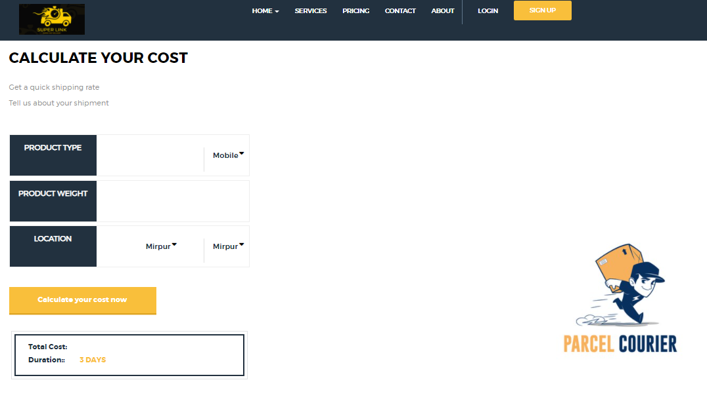

#  Project Name: Courier Management System 

```
Author Name: Kazi Effat Hossain
Author Email: effathossain67@gmail.com
```


## Technologies Used Here
- Spring boot
- Java
- JavaScript
- Bootstrap
- Css
- Mysql.


## Features of this project
  - User can send request for courier
  - User can track parcel with product id
  - Admin can view request and acccept request
  - Delivery Person can Update current location
  
  
  ### To run this Project you need 
  
  - Mysql
  
  ### How to run this project
Clone the project using the following command:

```
git clone https://github.com/KaziEffat01/courier-management-spring-boot.git
```

    - Run IDE
      - Open Project
      - Choose Designated Folder
    
    - Run MySql
      - Create a Schema "courier2" (without quotes)
      - If you want to have a different schema, change application.properties accordingly
  
  ### Sample Images

  ## Home Page
  

  ## Price Page
  